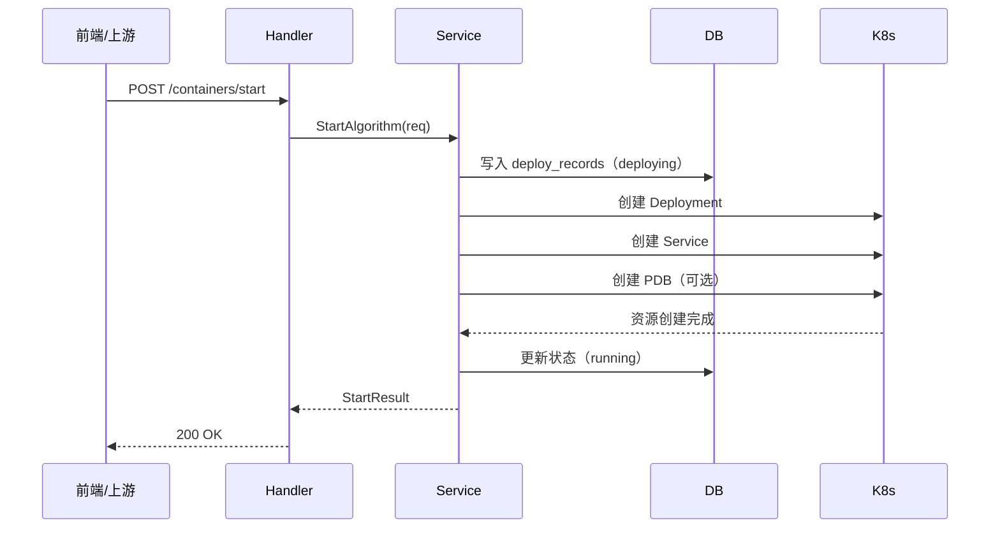

## API设计文档
### 1. 接口统一说明
除推理转发接口外，所有接口的正常返回格式均为：

```json
{
  "code": 0,
  "message": "success",
  "data": {}
}
```

失败时虽然设置了业务错误码，但 HTTP 状态码仍然返回 200，错误信息通过 body 中的 `code` 和 `message` 表达，例如：

```json
{
  "code": 400,
  "message": "image is required"
}
```
错误码说明

| code | 说明         |
| ---- | ------------ |
| 0    | 成功         |
| 400  | 参数错误     |
| 404  | 资源不存在   |
| 500  | 服务内部错误 |
因此，前端调用时应根据响应体中的 `code` 字段判断接口是否成功，不能仅根据 HTTP 状态码进行判断。

### 2.容器部署类接口
#### 2.1 启动算法容器
**2.1.1 接口**
```http
POST /api/v1/containers/start
Content-Type: application/json
```
**2.1.2 请求体**

| 字段           | 类型              | 必填 | 说明                                            |
| -------------- | ----------------- | ---: | ----------------------------------------------- |
| versionUuid    | string            |   否 | 算法版本 UUID，传后可从版本表回填镜像           |
| name           | string            |   否 | 算法名称                                        |
| version        | string            |   否 | 版本号                                          |
| image          | string            |   否 | 镜像地址；若不传则需要 versionUuid 能解析出镜像 |
| namespace      | string            |   否 | 命名空间，默认 default                          |
| deploymentName | string            |   否 | 自定义 Deployment 名称                          |
| serviceName    | string            |   否 | 自定义 Service 名称                             |
| port           | int               |   否 | 容器端口，默认 8080                             |
| replicas       | int               |   否 | 副本数，默认 1                                  |
| env            | map[string]string |   否 | 环境变量                                        |
| cpu            | string            |   否 | CPU 请求/限制，默认 500m                        |
| memory         | string            |   否 | 内存请求/限制，默认 512Mi                       |
| healthPath     | string            |   否 | 存活探针路径，默认 /healthz                     |
| readyPath      | string            |   否 | 就绪探针路径，默认 /ready                       |
| enablePDB      | bool              |   否 | 是否启用 PDB                                    |
| minAvailable   | int               |   否 | PDB 最小可用副本数                              |
| devMode        | bool              |   否 | 当前字段已定义，但当前部署逻辑未实际使用        |
| codeHostPath   | string            |   否 | 当前字段已定义，但当前部署逻辑未实际使用        |
| modelHostPath  | string            |   否 | 模型目录宿主机路径，挂到容器 `/models`          |

**2.1.3 请求体示例**

示例一：直接传镜像启动

```json
{
  "name": "gd-docker-preprocess",
  "version": "v1",
  "image": "gd-docker-preprocess:v1",
  "namespace": "default",
  "port": 8000,
  "replicas": 2,
  "env": {
    "MODEL_DIR": "/models",
    "LOG_LEVEL": "info"
  },
  "cpu": "500m",
  "memory": "512Mi",
  "healthPath": "/healthz",
  "readyPath": "/ready",
  "enablePDB": true,
  "minAvailable": 1,
  "modelHostPath": "/Users/yuan/models"
}
```

示例二：按 `versionUuid` 启动

```
{
  "versionUuid": "algo-version-001",
  "namespace": "default",
  "port": 8000,
  "replicas": 1
}
```

**2.1.4 返回示例**

```
{
  "code": 0,
  "message": "success",
  "data": {
    "deploymentName": "algo-gd-docker-preprocess-v1-a1b2c3d4",
    "serviceName": "algo-gd-docker-preprocess-v1-a1b2c3d4-svc",
    "namespace": "default"
  }
}
```

### 3. 容器查询类接口

#### 3.1 查询部署记录

**3.1.1 接口**

```
GET /api/v1/containers
```

**3.1.2 接口说明**

用于查询平台侧保存的部署记录。接口返回前会尝试根据 Kubernetes 当前状态刷新数据库中的部署状态信息。

**3.1.3 请求参数**

无

**3.1.4 返回示例**

```
{
  "code": 0,
  "message": "success",
  "data": {
    "items": [
      {
        "id": 1,
        "uuid": "e4a5d6f7-1234-5678-9abc-000000000001",
        "versionUuid": "algo-version-001",
        "namespace": "default",
        "k8sDeploymentName": "algo-gd-docker-preprocess-v1-a1b2c3d4",
        "k8sServiceName": "algo-gd-docker-preprocess-v1-a1b2c3d4-svc",
        "deployStatus": "running",
        "image": "gd-docker-preprocess:v1",
        "port": 8000,
        "replicas": 2,
        "readyReplicas": 2,
        "env": "{\"MODEL_DIR\":\"/models\"}",
        "resources": "{\"cpu\":\"500m\",\"memory\":\"512Mi\"}",
        "isDeleted": 0,
        "deployedAt": "2026-04-07T14:00:00+08:00",
        "updatedAt": "2026-04-07T14:05:00+08:00"
      }
    ],
    "total": 1
  }
}
```

#### 3.2 查询运行实例列表

**3.2.1 接口**

```
GET /api/v1/containers/runtime?namespace=default
```

**3.2.2 接口说明**

直接从 Kubernetes Deployment 列表构造返回结果，反映实例当前运行态信息。

**3.2.3 请求参数**

| 参数名    | 位置  | 类型   | 必填 | 说明                     |
| --------- | ----- | ------ | ---- | ------------------------ |
| namespace | query | string | 否   | 命名空间，默认 `default` |

**3.2.4 请求参数示例**

```
{
  "namespace": "default"
}
```

**3.2.5 返回示例**

```
{
  "code": 0,
  "message": "success",
  "data": {
    "items": [
      {
        "name": "algo-gd-docker-preprocess-v1-a1b2c3d4",
        "namespace": "default",
        "deployment": "algo-gd-docker-preprocess-v1-a1b2c3d4",
        "service": "algo-gd-docker-preprocess-v1-a1b2c3d4-svc",
        "status": "Running",
        "image": "gd-docker-preprocess:v1",
        "replicas": 2,
        "readyReplicas": 2
      }
    ],
    "total": 1
  }
}
```

#### 3.3 查询单个容器状态

**3.3.1 接口**

```
GET /api/v1/containers/:name/status?namespace=default
```

**3.3.2 接口说明**

用于查询指定 Deployment 对应实例的运行状态，包括副本数、就绪副本数和部署状态等信息。

**3.3.3 请求参数**

| 参数名    | 位置  | 类型   | 必填 | 说明                     |
| --------- | ----- | ------ | ---- | ------------------------ |
| name      | path  | string | 是   | Deployment 名称          |
| namespace | query | string | 否   | 命名空间，默认 `default` |

**3.3.4 请求参数示例**

```
{
  "name": "algo-gd-docker-preprocess-v1-a1b2c3d4",
  "namespace": "default"
}
```

**3.3.5 返回示例**

```
{
  "code": 0,
  "message": "success",
  "data": {
    "name": "algo-gd-docker-preprocess-v1-a1b2c3d4",
    "namespace": "default",
    "replicas": 2,
    "readyReplicas": 2,
    "availableReplicas": 2,
    "deployStatus": "running"
  }
}
```

### 4. 容器运维管理类接口

#### 4.1 扩缩容

**4.1.1 接口**

```
POST /api/v1/containers/:name/scale?namespace=default
Content-Type: application/json
```

**4.1.2 请求参数**

| 参数名    | 位置  | 类型   | 必填 | 说明                     |
| --------- | ----- | ------ | ---- | ------------------------ |
| name      | path  | string | 是   | Deployment 名称          |
| namespace | query | string | 否   | 命名空间，默认 `default` |

**4.1.3 请求体**

| 字段名   | 类型 | 必填 | 说明       |
| -------- | ---- | ---- | ---------- |
| replicas | int  | 是   | 目标副本数 |

**4.1.4 请求体示例**

```
{
  "replicas": 3
}
```

**4.1.5 返回示例**

```
{
  "code": 0,
  "message": "success",
  "data": {
    "name": "algo-gd-docker-preprocess-v1-a1b2c3d4",
    "namespace": "default",
    "replicas": 3
  }
}
```

#### 4.2 重启容器

**4.2.1 接口**

```
POST /api/v1/containers/:name/restart?namespace=default
```

**4.2.2 接口说明**

通过给 Deployment 的 PodTemplate 写入重启时间注解，触发滚动重启。该行为不修改业务配置，仅触发实例重新拉起。

**4.2.3 请求参数**

| 参数名    | 位置  | 类型   | 必填 | 说明                     |
| --------- | ----- | ------ | ---- | ------------------------ |
| name      | path  | string | 是   | Deployment 名称          |
| namespace | query | string | 否   | 命名空间，默认 `default` |

**4.2.4 请求参数示例**

```
{
  "name": "algo-gd-docker-preprocess-v1-a1b2c3d4",
  "namespace": "default"
}
```

**4.2.5 返回示例**

```
{
  "code": 0,
  "message": "success",
  "data": {
    "deploymentName": "algo-gd-docker-preprocess-v1-a1b2c3d4",
    "namespace": "default"
  }
}
```

#### 4.3 删除容器

**4.3.1 接口**

```
DELETE /api/v1/containers/:name?namespace=default
```

**4.3.2 接口说明**

删除容器时，系统会依次尝试删除 PDB、Deployment 和默认命名规则下的 Service，并将 `deploy_records` 表中的该记录标记为逻辑删除，状态更新为 `deleted`。

**4.3.3 请求参数**

| 参数名    | 位置  | 类型   | 必填 | 说明                     |
| --------- | ----- | ------ | ---- | ------------------------ |
| name      | path  | string | 是   | Deployment 名称          |
| namespace | query | string | 否   | 命名空间，默认 `default` |

**4.3.4 请求参数示例**

```
{
  "name": "algo-gd-docker-preprocess-v1-a1b2c3d4",
  "namespace": "default"
}
```

**4.3.5 返回示例**

```
{
  "code": 0,
  "message": "success",
  "data": {
    "deploymentName": "algo-gd-docker-preprocess-v1-a1b2c3d4",
    "namespace": "default"
  }
}
```

### 5. 容器业务与更新类接口

#### 5.1 推理接口转发

**5.1.1 接口**

```
POST /api/v1/containers/:name/infer?namespace=default
Content-Type: multipart/form-data
```

**5.1.2 接口说明**

该接口用于将平台接收到的文件和表单字段转发给下游算法服务的 `/infer` 接口。平台层不解析业务推理逻辑，返回值为算法服务原始响应，而不是统一的 `{code, message, data}` 包裹格式。

**5.1.3 请求参数**

| 参数名    | 位置  | 类型   | 必填 | 说明                     |
| --------- | ----- | ------ | ---- | ------------------------ |
| name      | path  | string | 是   | Deployment 名称          |
| namespace | query | string | 否   | 命名空间，默认 `default` |

**5.1.4 请求字段**

| 字段名     | 类型   | 必填 | 说明                           |
| ---------- | ------ | ---- | ------------------------------ |
| file       | file   | 是   | 上传文件                       |
| model_name | string | 否   | 示例业务字段，会透传给算法服务 |
| 其他字段   | string | 否   | 任意 form-data 字段，均可透传  |

**5.1.6 返回示例**

```
{
  "code": 0,
  "msg": "ok",
  "result": {
  }
}
```

#### 5.2 更新镜像

**5.2.1 接口**

```
POST /api/v1/containers/:name/image?namespace=default
Content-Type: application/json
```

**5.2.2 接口说明**

该接口用于直接修改 Deployment 当前运行镜像。系统更新镜像后会触发新的 rollout。该方式适合运维测试或直接指定镜像的场景。

**5.2.3 请求参数**

| 参数名    | 位置  | 类型   | 必填 | 说明                     |
| --------- | ----- | ------ | ---- | ------------------------ |
| name      | path  | string | 是   | Deployment 名称          |
| namespace | query | string | 否   | 命名空间，默认 `default` |

**5.2.4 请求体**

| 字段名 | 类型   | 必填 | 说明     |
| ------ | ------ | ---- | -------- |
| image  | string | 是   | 目标镜像 |

**5.2.5 请求体示例**

```
{
  "image": "gd-docker-preprocess:v2"
}
```

**5.2.6 返回示例**

```
{
  "code": 0,
  "message": "success",
  "data": {
    "deploymentName": "algo-gd-docker-preprocess-v1-a1b2c3d4",
    "namespace": "default",
    "image": "gd-docker-preprocess:v2"
  }
}
```

#### 5.3 更新版本

**5.3.1 接口**

```
POST /api/v1/containers/:name/version?namespace=default
Content-Type: application/json
```

**5.3.2 接口说明**

该接口用于按平台登记的算法版本执行升级。系统会根据 `versionUuid` 查询 `algorithm_versions`，校验版本是否为 `PUBLISHED`，再选择对应镜像更新 Deployment，并同步更新部署记录中的 `version_uuid` 和 `image`。

**5.3.3 请求参数**

| 参数名    | 位置  | 类型   | 必填 | 说明                     |
| --------- | ----- | ------ | ---- | ------------------------ |
| name      | path  | string | 是   | Deployment 名称          |
| namespace | query | string | 否   | 命名空间，默认 `default` |

**5.3.4 请求体**

| 字段名      | 类型   | 必填 | 说明          |
| ----------- | ------ | ---- | ------------- |
| versionUuid | string | 是   | 目标版本 UUID |

**5.3.5 请求体示例**

```
{
  "versionUuid": "algo-version-002"
}
```

**5.3.6 返回示例**

```
{
  "code": 0,
  "message": "success",
  "data": {
    "deploymentName": "algo-gd-docker-preprocess-v1-a1b2c3d4",
    "namespace": "default",
    "versionUuid": "algo-version-002"
  }
}
```
### 6.API调用时序


### 7. 补充说明

1. 查询类接口均为 `GET` 请求，不使用请求体，参数通过路径参数或查询参数传递。
2. 推理接口为 `multipart/form-data`，实际调用时应以表单上传方式传参。
3. 更新镜像与更新版本的语义不同：前者是直接指定镜像，后者是按平台版本体系进行升级。
