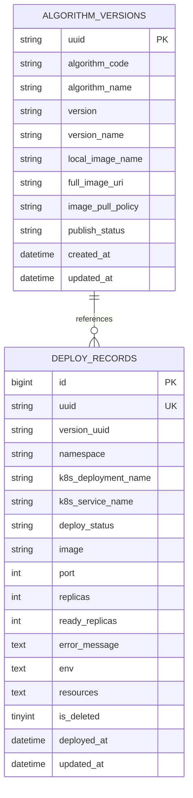

## 算法容器管理服务数据库设计文档

### 1 数据库需求分析

#### 1.1 需求分析

为将算法容器管理过程中的关键业务对象稳定地保存在关系型数据库中。结合系统功能，数据库需要支撑以下几类能力：

- 支撑算法版本管理。记录当前有哪些算法版本可用，以及每个版本对应的镜像信息、版本号和发布状态，用于算法启动和版本更新时进行查询与校验。
- 支撑实例管理。每次算法实例启动后，平台保存实例对应的命名空间、Deployment 名称、Service 名称、镜像地址、副本数、运行状态等信息，以便后续进行查询、扩缩容、重启、删除和运维管理。
- 支撑状态一致性维护。在镜像更新、版本更新、删除和状态刷新等操作发生后，数据库中的部署记录应及时同步更新，保证数据库信息与实际运行状态一致。

#### 1.2 ER 模型说明

### 2. 数据库逻辑设计

#### 2.1 表结构设计

**表一：algorithm_versions**

该表用于管理算法版本元数据，是部署和版本更新时查找镜像的基础。包括版本唯一标识、算法编码、算法名称、版本号、展示名、入口描述、运行时类型、配置路径、来源类型、本地镜像名、完整镜像地址、镜像大小、发布状态以及创建更新时间等。

结构如下：

| 字段名            | 类型         | 约束            | 说明                        |
| ----------------- | ------------ | --------------- | --------------------------- |
| uuid              | varchar(64)  | PK              | 版本唯一标识                |
| algorithm_code    | varchar(64)  | not null, index | 算法编码                    |
| algorithm_name    | varchar(128) | not null        | 算法名称                    |
| version           | varchar(64)  | not null        | 版本号                      |
| version_name      | varchar(128) | null            | 版本展示名                  |
| entrypoint        | varchar(255) | null            | 启动入口描述                |
| runtime_type      | varchar(32)  | null            | 运行时类型                  |
| config_path       | varchar(255) | null            | 配置路径                    |
| source_type       | varchar(32)  | null            | 来源类型                    |
| local_image_name  | varchar(255) | null            | 本地镜像名                  |
| image_pull_policy | varchar(32)  | null            | 镜像拉取策略                |
| full_image_uri    | varchar(512) | null            | 完整镜像地址                |
| image_size        | varchar(64)  | null            | 镜像大小                    |
| publish_status    | varchar(32)  | null, index     | DRAFT / PUBLISHED / OFFLINE |
| created_at        | datetime     | system managed  | 创建时间                    |
| updated_at        | datetime     | system managed  | 更新时间                    |

**表二：deploy_records**

该表用于记录部署实例，是平台管理侧最核心的业务表。字段包括部署 UUID、版本 UUID、命名空间、Deployment 和 Service 名称、部署状态、访问地址、镜像、端口、副本数、就绪副本数、错误信息、环境变量、资源 JSON、删除标志和时间字段等。

结构如下：

| 字段名              | 类型            | 约束                       | 说明                             |
| ------------------- | --------------- | -------------------------- | -------------------------------- |
| id                  | bigint unsigned | PK, auto_increment         | 主键                             |
| uuid                | varchar(36)     | unique index               | 部署唯一标识                     |
| version_uuid        | varchar(64)     | null, index                | 关联算法版本 UUID                |
| namespace           | varchar(64)     | null                       | 命名空间                         |
| k8s_deployment_name | varchar(128)    | index                      | Deployment 名称                  |
| k8s_service_name    | varchar(128)    | null                       | Service 名称                     |
| deploy_status       | varchar(32)     | index                      | deploying/running/failed/deleted |
| access_endpoint     | varchar(255)    | null                       | 访问地址，当前预留               |
| image               | varchar(512)    | null                       | 当前实际镜像                     |
| port                | int             | null                       | 服务端口                         |
| replicas            | int             | null                       | 目标副本数                       |
| ready_replicas      | int             | null                       | 就绪副本数                       |
| error_message       | text            | null                       | 错误信息                         |
| env                 | text            | null                       | 环境变量 JSON                    |
| resources           | text            | null                       | 资源 JSON                        |
| is_deleted          | tinyint(1)      | not null, default 0, index | 逻辑删除标志                     |
| deployed_at         | datetime        | autoCreateTime             | 部署创建时间                     |
| updated_at          | datetime        | autoUpdateTime             | 更新时间                         |

####  2.2 表关系说明

本系统当前数据库包含两张核心业务表：`algorithm_versions` 和 `deploy_records`。

其中，`algorithm_versions` 用于保存算法版本元数据，记录某个算法版本对应的镜像信息、发布状态及相关描述信息；`deploy_records` 用于保存算法实例部署记录，记录实例在 Kubernetes 中的部署信息、运行状态及相关配置。

两张表之间通过 `deploy_records.version_uuid` 与 `algorithm_versions.uuid` 建立关联关系，具体关系如下：

- `algorithm_versions.uuid` 为算法版本表主键；
- `deploy_records.version_uuid` 为部署记录表中的版本关联字段；
- 一个算法版本可以对应多个部署实例；
- 一个部署实例在任一时刻最多关联一个算法版本；
- 当实例通过“版本更新”方式升级时，`version_uuid` 记录当前对应的算法版本；
- 当实例通过“直接镜像更新”方式升级时，`version_uuid` 置空，仅保留 `image` 字段表示当前实际运行镜像。

#### 2.3 关键字段取值说明

为保证数据库字段含义明确，系统对部分关键状态字段约定如下：

**1）publish_status**

`publish_status` 用于表示算法版本的发布状态，主要取值包括：

- `DRAFT`：草稿状态，版本已登记但尚未发布，不允许正式部署；
- `PUBLISHED`：已发布状态，允许被启动或用于版本更新；
-  `OFFLINE`：已下线状态，不建议继续用于新实例部署。

**2）deploy_status**

`deploy_status` 用于表示部署实例当前状态，主要取值包括：

- `deploying`：部署中，实例已创建记录但尚未完全就绪；
-  `running`：运行中，Deployment 和 Pod 已正常提供服务；
-  `failed`：运行异常，部署失败或实例状态异常；
-  `deleted`：已删除，实例资源已删除或已逻辑删除。

**3）is_deleted**

`is_deleted` 用于表示部署记录是否被逻辑删除，主要取值包括：

`0`：未删除；	 `1`：已删除。

#### 2.4 索引设计说明

**algorithm_versions 表：**

- `uuid`：主键索引，用于唯一标识算法版本；
- `algorithm_code`：普通索引，用于按算法编码查询版本列表；
-  `publish_status`：普通索引，用于按发布状态筛选可部署版本。

**deploy_records 表：**

- `id`：主键索引；

- `uuid`：唯一索引，用于唯一标识部署记录；

- `version_uuid`：普通索引，用于按算法版本查询关联实例；

- `k8s_deployment_name`：普通索引，用于按 Deployment 名称快速查询记录；

- `deploy_status`：普通索引，用于按实例状态筛选部署记录；

-  `is_deleted`：普通索引，用于过滤逻辑删除数据。

当前索引设计主要满足以下场景：

- 启动或升级时按 `version_uuid` 查询版本；
-  查询部署记录时按 `is_deleted`、`deploy_status` 过滤；
- 根据 Deployment 名称查询对应部署记录；

- 按算法编码查询版本列表。

### 3 数据一致性设计

#### 3.1 一致性设计

本系统数据一致性设计的目标主要包括：

- 保证版本信息与实例记录之间的关联关系清晰；
-  保证部署记录中的镜像信息与实例当前实际运行镜像一致；
-  保证实例删除后数据库中状态同步变更；
-  保证查询接口返回的管理侧信息与集群状态尽量一致。

#### 3.2 一致性实现

**启动场景下的一致性维护**

当平台启动算法实例时，系统在完成 Kubernetes 资源创建后，会向 `deploy_records` 表写入对应的部署记录。记录内容包括版本信息、部署名称、服务名称、镜像、副本数和部署状态等。通过该方式，数据库能够保存实例的基础管理信息，并与实际部署资源建立对应关系。

**更新场景下的一致性维护**

当实例发生版本更新或镜像更新时，系统会在更新 Kubernetes 中 Deployment 镜像成功后，同步更新数据库中的部署记录。其中，版本更新会同步更新 `version_uuid` 和 `image`；镜像更新会同步更新 `image`，并清空 `version_uuid`。通过该方式，数据库记录能够准确反映实例当前的运行镜像及其管理方式。

**查询场景下的一致性维护**

当平台执行实例查询或状态查询时，会结合 Kubernetes 中的实际运行状态对数据库中的部署记录进行刷新。刷新内容主要包括部署状态、就绪副本数和更新时间等，从而保证管理侧查询结果与集群中的实际状态尽量一致。

**删除场景下的一致性维护**

当实例被删除时，系统在删除 Kubernetes 中相关资源后，会同步更新数据库中的部署记录，将其标记为已删除，并更新部署状态。通过逻辑删除方式，既可以保留历史部署记录，也可以避免已删除实例继续出现在正常管理列表中。