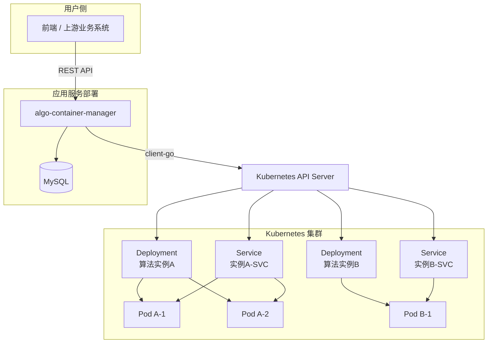

# 算法容器管理服务技术文档

## 1. 引言
项目本质上是一个基于 **Go + Gin + GORM + Kubernetes client-go** 的算法容器管理服务，用于将“算法镜像/算法版本”转化为可运行的 Kubernetes Deployment，并提供容器生命周期管理与推理转发能力。

## 2. 功能需求
该系统位于上层业务系统与 Kubernetes 集群之间，承担以下职责：

- 接收算法容器启动和运维请求。
- 将请求转换为 Kubernetes 资源对象。
- 创建并管理 Deployment、Service、PodDisruptionBudget。
- 持久化部署记录，形成管理侧视图。
- 查询运行态状态，并对容器进行扩缩容、重启、删除、镜像更新、版本更新。
- 将上传文件转发到算法服务的 `/infer` 接口，实现平台侧统一转发。

## 3. 架构设计

### 3.1 代码结构说明
```text
kubernetes/
├── cmd/server/main.go                  # 服务启动入口
├── internal/api/                       # HTTP 接口层
│   ├── route.go                        # 路由定义
│   └── handler.go                      # 请求处理
├── internal/service/                   # 业务编排层
│   ├── container.go
│   ├── container_start.go              # 启动编排
│   ├── container_runtime.go            # 查询、删除、扩缩容、重启
│   ├── container_infer.go              # 推理转发
│   ├── container_update_image.go       # 镜像更新
│   └── container_update_version.go     # 版本更新
├── internal/k8s/                       # Kubernetes 操作层
│   ├── client.go                       # client-go 初始化
│   ├── deployment.go                   # 创建 Deployment
│   ├── service.go                      # 创建 Service
│   ├── pdb.go                          # 创建 PDB
│   ├── list.go                         # 列表/状态工具
│   ├── infer.go                        # service proxy 转发
│   ├── scale.go                        # 扩缩容
│   ├── restart.go                      # 重启
│   ├── update_image.go                 # 更新镜像
│   ├── delete.go                       # 删除 Deployment / Service
│   ├── delete_service.go               # 删除 Service
│   ├── delete_pdb.go                   # 删除 PDB
│   └── logs.go                         # Pod 日志读取（当前未暴露 HTTP）
├── internal/model/                     # 请求/响应/数据库模型
├── internal/common/                    # 通用工具
│   ├── naming.go                       # 名称构造
│   ├── labels.go                       # 标签构造
│   ├── envVars.go                      # 环境变量构造
│   └── response.go                     # 统一响应封装
└── internal/db/mysql.go                # DB 初始化与 AutoMigrate
```
### 3.2 系统总体架构



### 3.3 分层职责设计

系统整体采用分层设计，主要包括 API 层、Service 层、Kubernetes 操作层、Model 层和公共工具层，各层职责如下：

**API 层**
 负责接收外部 HTTP 请求，完成参数绑定、基础校验、调用业务服务，并统一封装响应结果。该层不直接处理复杂业务逻辑，主要承担接口适配与请求分发职责。

**Service 层**
 负责系统核心业务编排，是算法容器管理服务的核心实现层。主要包括部署启动、实例查询、扩缩容、重启、删除、镜像更新、版本更新和推理转发等业务逻辑，同时负责数据库记录与 Kubernetes 资源状态之间的一致性维护。

**Kubernetes 操作层**
 负责通过 client-go 与 Kubernetes API Server 交互，执行 Deployment、Service、PodDisruptionBudget 等资源的创建、查询、更新与删除操作，为上层业务提供底层集群能力支撑。

**Model 层**
 负责定义请求参数模型、响应模型及数据库表结构，用于统一系统内部的数据组织方式，并支撑数据库表自动迁移。

**公共工具层**
 负责实现命名生成、标签构造、环境变量转换、统一响应封装等通用能力，减少重复代码，提高系统可维护性。


### 3.4 核心流程设计

#### 3.4.1 启动流程

算法容器启动流程如下：

1. 上层业务系统调用启动接口，提交算法名称、版本、镜像、资源参数等信息；
2. API 层接收请求并完成参数解析；
3. Service 层根据请求内容补全默认值，并根据版本信息或镜像信息确定最终部署参数；
4. 通过 Kubernetes 操作层创建 Deployment、Service 和可选的 PodDisruptionBudget；
5. 资源创建成功后，将部署记录写入数据库；
6. 返回部署名称、服务名称及命名空间等信息。

#### 3.4.2 查询流程

查询流程分为管理视图查询和运行态查询两类：

- 管理视图查询：从数据库中读取部署记录，并结合 Kubernetes 当前状态刷新部署状态后返回；
- 运行态查询：直接从 Kubernetes 集群查询 Deployment 实例信息，返回当前运行状态、镜像、副本数等内容。

#### 3.4.3 更新流程

系统支持两类更新方式：

- **镜像更新**：直接指定新的镜像地址更新 Deployment，同时同步更新数据库中的 `image` 字段，并清空 `version_uuid`；
- **版本更新**：根据平台登记的算法版本查询目标镜像，更新 Deployment 后同步更新数据库中的 `version_uuid` 和 `image` 字段。

#### 3.4.4 删除流程

删除实例时，系统会依次删除相关 Kubernetes 资源，并在数据库中将对应部署记录标记为逻辑删除，同时更新部署状态为 `deleted`，以保留历史记录。

## 4. 数据设计

**详见[数据库设计文档](数据库设计文档.md)**

## 5. 接口设计

**详见[API接口文档](./API设计文档.md)**

## 6.测试设计

**详见[测试文档](./测试文档.md)**